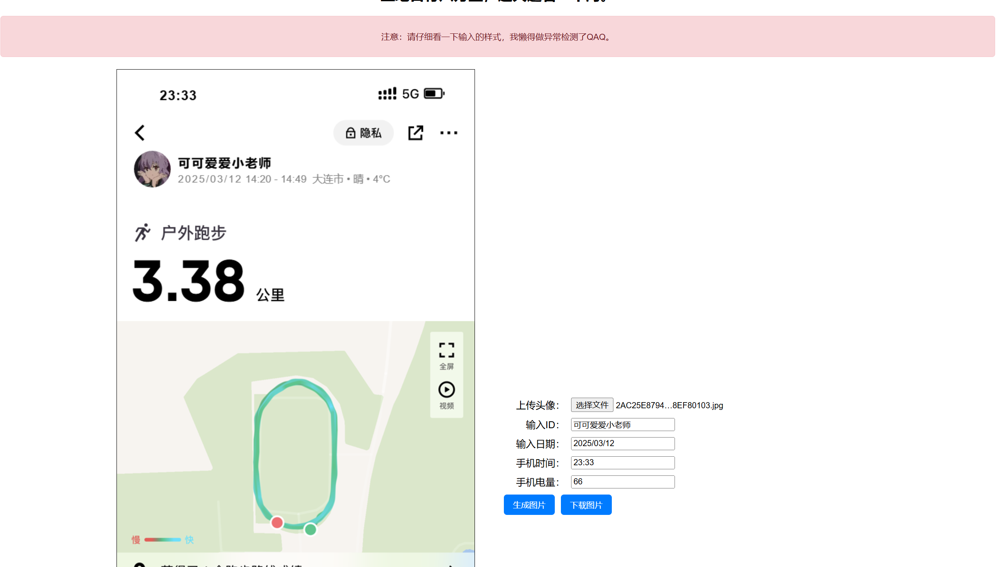
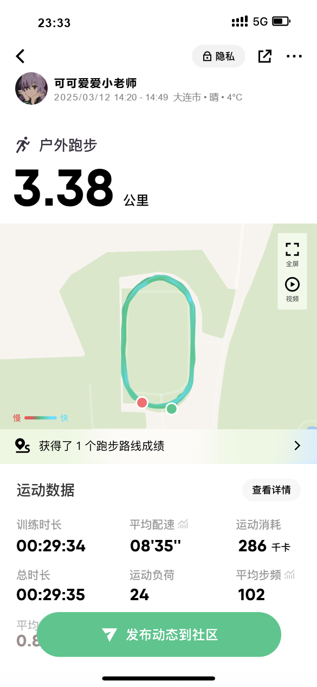

>**大黑山的妖风**肆虐着这片土地，昏暗的灯光下，一排排的**窝工战士**在操场上匍匐前进着，他们手中的手机发出**微弱的灯光**，在操场上汇聚成一条**流动的海洋**。。。

>“下周就要**收keep截图**了，今天也要打卡啊———”

**“好想，好想，好想坐地日行八万里，巡天遥看一千河啊————”**


<!-- more -->

起因就是窝工为了弘扬体育健康精神，为了窝工学子都能为祖国健康工作五十年，要求窝工学子每学期必须完成三十次keep运动打卡。

一学期三十次，平均4天打一次卡，这听着似乎并不难。但是窝工深入大黑山脚下，怀抱渤海之湾，享受着山风海风的轮流照顾。在窝工走路尚且困难，更不用提在操场上跑步了。

我和我的同学无数次思考怎么解决这个问题：校准手机的配速；背书包带着大家的手机一起跑步；做一个循迹小车沿着操场转圈；做一个四轴飞行器在操场上自动巡航；刷root自己模拟手机的GPS信号；反向抓包伪造keep数据。。。大家为了此事各显神通，各自也都取得了不小的成果。这里分享我为窝工keep事业所做出的一份贡献：拿js做一个假界面来仿制截图。

## 功能介绍

1. 随机生成一些在窝工操场跑步的路线图（其实就是我之前跑步的截图）。
2. 随机生成一个看起来不错的跑步距离和时间。
3. 根据距离和时间计算配速等数据。
4. 支持用户选择截图时间，截图手机电量，跑步时间（精确到天），自己上传自己的头像和id。
5. 支持预览图像与下载图像。

## 效果演示





## 实现

项目地址：https://acidbarium.github.io/SSDUTkeepMoving/

仓库地址：https://github.com/AcidBarium/SSDUT-KeepMoving

这个项目还挺简单的，差不多一下午就做完了（不得不说现在的人工智能还是太厉害了）

html和css文件都是我找ai做的，感觉和我描述的样子差不太多，很简洁。如果希望能自定义一些选项，比如自定义跑步的时间和配速，在html里面加上喜欢的内容，再去js里面稍微改一下文字的输出就行了。

关于跑道，我使加载一些我之前跑过的路线图，然后随机生成的，详情见代码
```js
// 图片数组（存放服务器图片 URL）
const imagesPaodao = [
    "./source/1.png",
    "./source/2.png",
    "./source/3.png",
    "./source/4.png",
    "./source/5.png",
    "./source/6.png",
    "./source/7.png"
];

let loadedImagesPaoDao = new Array(imagesPaodao.length); // 预留空间，确保索引匹配

// **预加载所有图片**
imagesPaodao.forEach((src, index) => {
    let img = new Image();
    img.src = src;
    img.onload = function () {
        loadedImagesPaoDao[index] = img; // 确保存入正确索引
        // console.log(`图片 ${index} 加载完成`);
    };
});

// **绘制指定索引的图片**
function drawImagePaoDaoByIndex(index, x, y, width, height) {
    if (loadedImagesPaoDao[index]) {
        ctx.drawImage(loadedImagesPaoDao[index], x, y, width, height);
    } else {
        console.log(`图片 ${index} 还未加载`);
    }
}
```

keep的数字的样式比较独特，富有青春感，我在网上识别了这个数字可能的字体，然后下在一个导入就可以了
```css
@font-face {
    font-family: 'Qanelas';
    src: url('fonts/Qanelas-Bold.otf') format('truetype');
    /* 确保路径正确 */
}
```

```js
function drawText(text, x, y, fontSize = 30, textColor = "red", isBold = false, letterSpacing = 0, isNum = false) {
    const fontWeight = isBold ? "bold" : "normal"; // 是否加粗
    if (isNum == false) {
        ctx.font = `${fontWeight} ${fontSize}px Arial`; // 设置字体
    }
    else {
        ctx.font = `${fontWeight} ${fontSize}px Qanelas`; // 设置字体
    }

    // ctx.font = `${fontWeight} ${fontSize}px 'Qanelas ExtraBold', Arial`; // 设定字体
    ctx.fillStyle = textColor;
    ctx.textAlign = "left"; // 左对齐

    let currentX = x; // 当前绘制的 X 坐标

    for (let i = 0; i < text.length; i++) {
        ctx.fillText(text[i], currentX, y); // 绘制单个字符
        currentX += ctx.measureText(text[i]).width + letterSpacing; // 计算下一个字符的位置
    }
}
```

有关天气，天气是随机的，但是气温不是，气温是根据日期算的。我隐隐约约地记得高一的时候地理老师讲过，气温大致符合一个正弦图像，就简单地写了一个，看着貌似也还凑合。
```js
    let isWeather = getRandomInt(1, 20);
    let weather = "晴";
    if (isWeather <= 10)
        weather = "晴";
    else if (isWeather == 16)
        weather = "阴";
    else if (isWeather == 17) {
        weather = "多云";
    } else if (isWeather == 18) {
        weather = "轻度雾霾";
    } else {
        weather = "阴";
    }

    if (!textDate) {
        textDate = "2024/02/29"
    }
    let numDate = convertDateToNumber(textDate);
    let temputure = 20 * Math.sin(3.14 / 6.0 * (numDate - 4.0)) + 7.5 + parseFloat(getRandomFloat(0, 2.5));
    // let temputure = 20 * Math.sin(3.14 / 6.0 * (numDate - 4.0)) + 7.5 ;
    temputure = temputure.toFixed(0);

    drawText("大连市 • " + weather + " • " + String(temputure) + "°C", 320, 185, 17, "grey", false, 0);   //输出跑步天气和地点
```

豪！剩下的都是些无足轻重的小事了（虽然上面的也不怎么重要）就不再介绍了。

## 感受

- 最想说的是，科技应该为生活服务，这样可能会做出有用又快乐的东西出来。比如我之前做一个网格的项目，我就很想跑路，虽然最后也做完了（主要是我朋友发力），而且做的还挺不错的，但是没用我去做爬虫和这个keep那么充满干劲。
- 科技来源于生活，想要做出一些东西，我们应该先去生活，在生活中思考能否用科技来改变这些事情，脱离了生活就没有科技。
- 现在的人工智能挺发达了，想做什么事情到处都是途径。我只是在去年的暑假学过有点html和css，js也是现学现用的。但是依旧可以把这个网页给做出来。嗯，对，是这样的，时代或许变了，我们没必要准备好再出发，想做什么直接去做就行，直接在gpt或者ds的官网上问他：我想要（）我该怎么办。事无巨细，会给你说的很清楚，直接下手去做就行。

## 结语

好了，话就到这里吧，希望大家都能找到自己想做的事情，做点对世界有用的事情。

